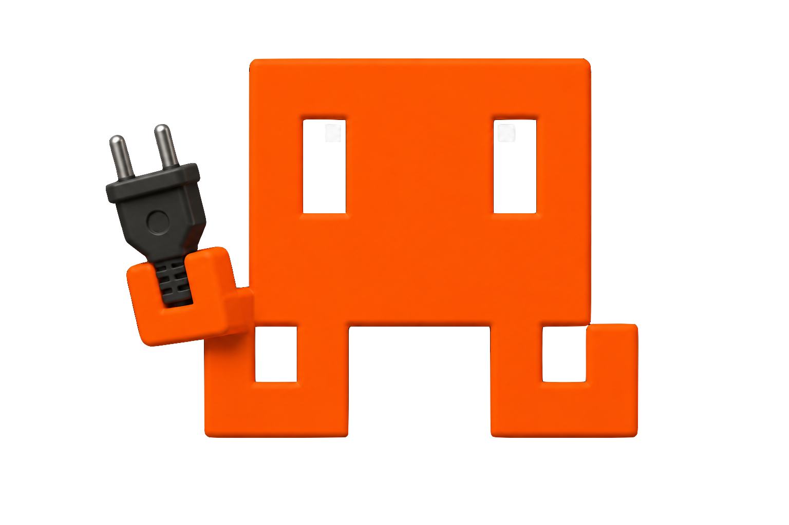

<p align="center">
    
</p>

<h1 align="center">Writing Cowrangler Plugins</h1>

<p align="center">
  <strong>Extend the agent with your own tools, models, providers, skills, and actions</strong>
</p>

---

A **plugin** is a self-contained folder that Cowrangler loads at startup and lets register new capabilities into the same agent engine used by the CLI, Desktop, and Design surfaces. One plugin can contribute any mix of:

- **Tools** — new functions the agent can call.
- **Models & providers** — extra models in the picker, backed by a custom (often OpenAI-compatible) endpoint, with optional sign-in gating.
- **Skills** — reusable SOP/skill folders.
- **Sub-agents** — specialized agents for `spawn_subagent`.
- **Actions** — user-triggerable buttons (e.g. "Sign in") surfaced in the Desktop UI.

The reference implementation is [`cowrangler-antigravity-auth`](./.cowrangler/plugins/cowrangler-antigravity-auth) (OAuth login + provider + gated models).

---

## Where plugins live

Cowrangler discovers plugins from two directories. Local plugins override global ones with the same `id`.

| Scope | Path | Use for |
|---|---|---|
| **Global** | `~/.cowrangler/plugins/<plugin>/` | Available in every workspace on the machine |
| **Local** | `./.cowrangler/plugins/<plugin>/` | Scoped to a single repository (higher priority) |

You can also install through the Desktop **Extensions** surface (from a Git URL or a `.zip`), which unpacks into the global plugins directory.

---

## Anatomy of a plugin

A plugin folder must contain a **`plugin.json`** manifest and a compiled **`index.js`** entry point:

```
my-plugin/
├── plugin.json        # manifest (required)
├── index.js           # compiled entry, exports async setup(ctx) (required)
├── package.json       # your deps / build scripts (optional)
├── skills/            # any skill folders you register (optional)
└── src/               # your TypeScript source (optional)
```

### `plugin.json`

Only these fields are read by the loader; everything else is ignored.

```json
{
  "id": "my-plugin",
  "name": "My Plugin",
  "version": "1.0.0",
  "description": "Adds a weather tool and a custom model."
}
```

> `id` should be unique and stable — it's how the plugin is keyed, overridden, and referenced by the UI. If omitted, the folder name is used.

### `index.js`

The entry must export an async `setup(ctx)` function. Cowrangler imports `index.js` and calls `setup` once at startup, passing a **`PluginContext`**:

```ts
export async function setup(ctx) {
  // ctx.pluginDir : absolute path to this plugin folder
  // ctx.config    : the resolved Cowrangler config
  // register capabilities here…
}
```

---

## The `PluginContext` API

Everything you register is attributed to your plugin and surfaced as contribution badges (tools / models / skills / providers / actions) in the UI.

### `registerTool(name, description, parameters, execute)`

Adds a tool the agent can call. `parameters` is a JSON-Schema object; `execute(args)` returns the tool result.

```ts
ctx.registerTool(
  "get_weather",
  "Get the current weather for a city.",
  {
    type: "object",
    properties: { city: { type: "string", description: "City name" } },
    required: ["city"],
  },
  async ({ city }) => {
    const res = await fetch(`https://api.example.com/weather?q=${encodeURIComponent(city)}`);
    return await res.text();
  },
);
```

### `registerModel(modelId, metadata)`

Adds a model to the picker (shown alongside the user's saved models). Use a `prefix/model` id so it routes to your provider.

```ts
ctx.registerModel("myprovider/fast-1", {
  contextWindow: 128_000,
  supportsThinking: false,
  // …other ModelMeta fields
});
```

### `registerProviderInterceptor(providerId, interceptor)`

Backs a provider (the `prefix` of your model ids) with a custom transport and optional readiness probe.

```ts
ctx.registerProviderInterceptor("myprovider", {
  apiKey: process.env.MYPROVIDER_KEY,
  headers: { "X-Client": "cowrangler" },
  // Optional: gate the models until the user is signed in.
  status: async () => ({
    ready: Boolean(await hasValidToken()),
    reason: "Sign in to MyProvider to use these models",
    actionId: "login", // points at a registerAction() below
  }),
});
```

When `status().ready` is `false`, every model from this provider is shown **locked** in the picker with a button that runs the referenced action.

### `registerAction(action)`

Exposes a user-triggerable button (e.g. an OAuth login). The host supplies `openUrl` and `log`.

```ts
ctx.registerAction({
  id: "login",
  title: "Sign in",
  description: "Authenticate with MyProvider",
  icon: "log-in", // optional lucide icon name
  run: async ({ openUrl, log }) => {
    const url = await beginOAuth();
    await openUrl(url);
    log("Waiting for authorization…");
    const ok = await completeOAuth();
    return { ok, message: ok ? "Signed in." : "Login failed." };
  },
});
```

### `registerSkillPath(dirPath)`

Registers a directory of skill folders so their skills become available to the agent.

```ts
import path from "path";
ctx.registerSkillPath(path.join(ctx.pluginDir, "skills"));
```

### `registerSubAgent(name, definition)`

Adds a specialized sub-agent that can be launched with `spawn_subagent`.

---

## Minimal example

`plugin.json`

```json
{ "id": "hello-tool", "name": "Hello Tool", "version": "1.0.0", "description": "A one-tool demo." }
```

`index.js`

```js
export async function setup(ctx) {
  ctx.registerTool(
    "say_hello",
    "Return a friendly greeting for a name.",
    { type: "object", properties: { name: { type: "string" } }, required: ["name"] },
    async ({ name }) => `Hello, ${name}! 👋`,
  );
}
```

Drop the folder into `~/.cowrangler/plugins/hello-tool/` and restart Cowrangler — the `say_hello` tool is now available to the agent, and the plugin appears (with a "1 tool" badge) in the Extensions list.

---

## Build & distribution notes

- **Ship compiled JS.** The loader imports `index.js` directly, so bundle/transpile your TypeScript first (e.g. with `esbuild` or `tsc`) and include the output. Keep runtime dependencies inside the plugin folder.
- **Fail safe.** A throwing `setup` is caught and logged; it won't crash the host, but your plugin simply won't register anything.
- **Idempotent registration.** `setup` may run again after an install/reload — re-registering the same action `id` replaces the previous one, so avoid side effects that assume a single run.
- **Distribute** as a Git repository or a `.zip` containing the plugin folder (with `plugin.json` at its root) for install via the Desktop Extensions surface.

---

Back to the [main README](./README.md).
