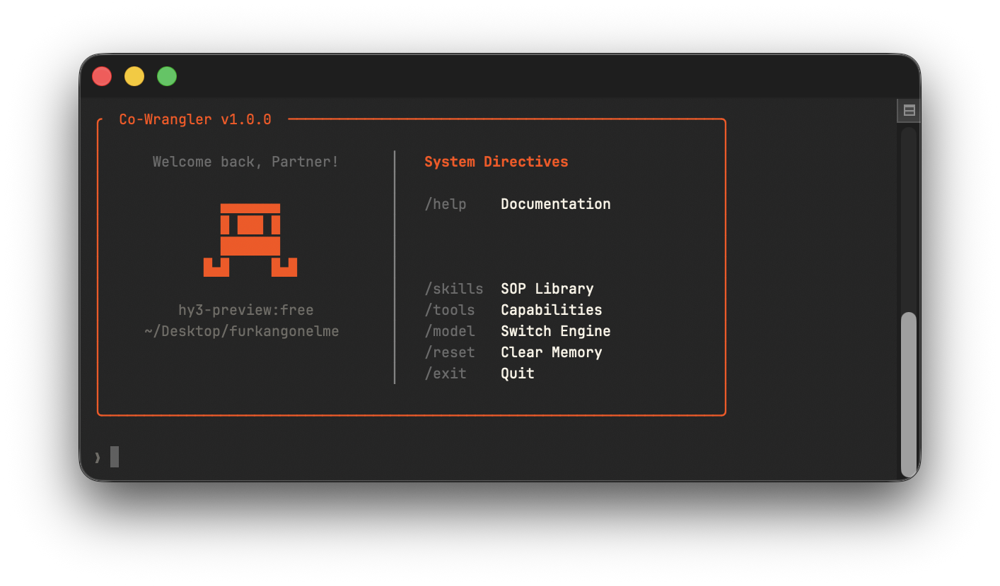

<p align="center">
  
</p>

<h1 align="center">co-wrangler</h1>

<p align="center">
  <strong>tame the AI chaos right from your terminal</strong>
</p>

<p align="center">
  
  
  <a href="LICENSE"></a>
</p>

<p align="center">
  <a href="#dual-brain-architecture">Architecture</a> •
  <a href="#install">Install</a> •
  <a href="#commands">Commands</a> •
  <a href="#skills--sops">Skills</a>
</p>

---

A highly autonomous, terminal-native AI engineering agent. Designed to wrangle complex codebases, manage local files, and execute Standard Operating Procedures (SOPs), it acts as your dedicated local co-pilot.

Unlike standard web-based chat interfaces, Co-Wrangler lives directly in your terminal. It understands the context of your current working directory, dynamically loads project-specific architectural rules, and securely manages your API keys in a centralized vault.

<br>

<p align="center">
  
</p>

<br>

## Dual-Brain Architecture

Two directories. Total control over your AI environment.

<table>
<tr>
<td width="50%">

### 🌍 Global Scope 
`~/.cowrangler`

- **Secure Vault:** `credentials.env` keeps API keys centralized. No `.env` copying across projects.
- **Core Config:** `config.yaml` for your global default AI engine.
- **Universal Rules:** `skills/` for system-wide SOPs.

</td>
<td width="50%">

### 📍 Local Scope
`./.cowrangler`

- **Project Memory:** `memory.md` loads tech stack & rules on boot.
- **State Tracking:** `AGENT_TODO.md` manages pending tasks across sessions.
- **Local Overrides:** `config.yaml` and `skills/` for this repo only.

</td>
</tr>
</table>

## Install

**1-Click Installation & Quick Start**
```bash
# 1. Install Globally
git clone [https://github.com/furkangonel/co-wrangler.git](https://github.com/furkangonel/co-wrangler.git)
cd co-wrangler
npm run setup

# 2. Set Your API Key (Only once per machine!)
cowrangler
❯ /key set OPENROUTER_API_KEY sk-or-v1-your-key-here

# 3. Start Hacking
cd ~/my-awesome-project
cowrangler
```

## Commands

System directives to manage your AI environment on the fly.

| Command | What it do |
|---|---|
| `/help` | Displays the user manual and available commands. |
| `/model add <name>` | Registers a new AI engine (e.g., `openrouter/anthropic/claude-3-5-sonnet`). |
| `/model set <name> [scope]` | Switches the active model. Use `local` to override the global setting for the current project only. |
| `/model list` | Lists all registered AI models in your environment. |
| `/key set <PROVIDER> <KEY>`| Securely saves an API key to your global vault. |
| `/key list` | Displays your saved API keys (safely masked for screen-sharing). |
| `/tools` | Lists all available system tools (file read/write, web search, etc.). |
| `/skills` | Lists all loaded Standard Operating Procedures (SOPs). |
| `/skill <id> <task>` | Forces the agent to utilize a specific skill before executing the given task. |
| `/reset` | Flushes the current conversation history while preserving core project memory. |
| `/exit` | Safely terminates the session and exits the CLI. |

## Skills / SOPs

You can extend Co-Wrangler's capabilities by adding Markdown files to the `skills/` directory (either global or local). 

Create a folder (e.g., `clean_code`) and inside it, a `SKILL.md` file with YAML frontmatter:
```markdown
---
name: Clean Code Standards
description: General rules for writing clean, modular, and maintainable code.
---

1. Functions must adhere to the Single Responsibility Principle.
2. Avoid magic numbers; use clear, descriptive constants instead.
3. Always comment complex business logic and edge cases.
4. Variable names must be descriptive and written in English.
```

Then force the agent to use it during a task:
```bash
❯ /skill clean_code Refactor the user authentication controller.
```

## Contributing

Contributions are highly welcome! Whether you want to add new core tools, fix bugs, or improve the UI:

1. Fork the Project
2. Create your Feature Branch (`git checkout -b feature/AmazingFeature`)
3. Commit your Changes (`git commit -m 'Add some AmazingFeature'`)
4. Push to the Branch (`git push origin feature/AmazingFeature`)
5. Open a Pull Request

## License

MIT — free to use, modify, and distribute.
