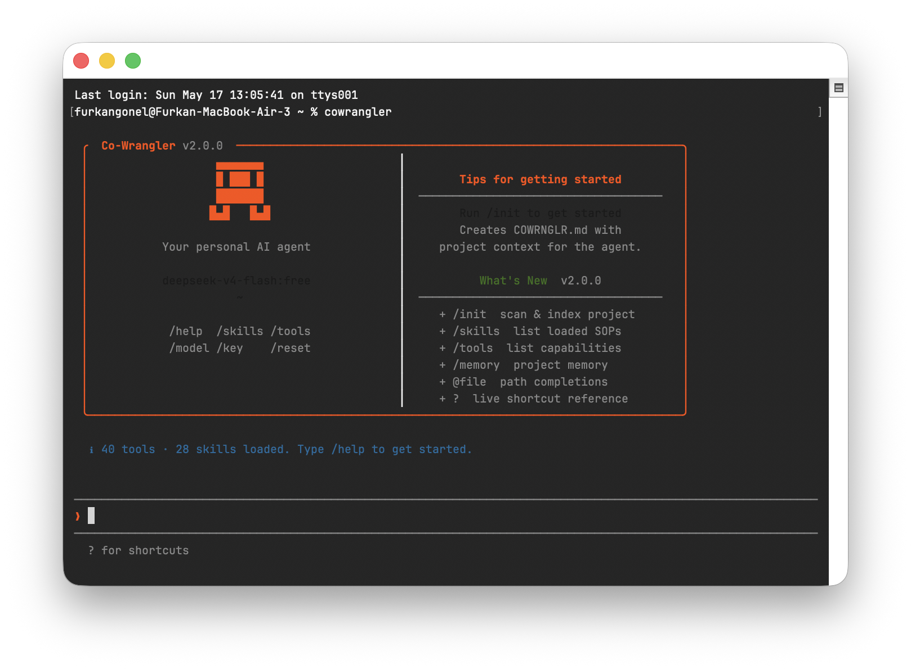

<p align="center">
  
</p>

<h1 align="center">Co-Wrangler</h1>

<p align="center">
  <strong>Tame the AI chaos right from your terminal</strong>
</p>

<p align="center">
  
  
  
  <a href="LICENSE"></a>
</p>

<p align="center">
  <a href="#what-is-this">What is This?</a> •
  <a href="#architecture">Architecture</a> •
  <a href="#quick-start">Quick Start</a> •
  <a href="#features">Features</a> •
  <a href="#tools">Tools</a> •
  <a href="#subagents">Subagents</a> •
  <a href="#skills--agents">Skills & Agents</a> •
  <a href="#commands">Commands</a>
</p>

---

## What is This?

Co-Wrangler is not just another chat wrapper. It's a terminal-native AI agent built for developers who want real work done — from code review and test writing to macOS desktop automation and GitHub workflow management.

**What can it do?**
- Read, edit, and create files across your entire codebase
- Manage Git operations (commit, branch, diff, stash)
- Fetch data from the web, make API requests
- Control your macOS desktop in the background (no cursor hijacking)
- Delegate complex tasks to specialized subagents
- Maintain project memory and context across sessions
- Enforce your team's Standard Operating Procedures (SOPs) via Skills
- Plan and execute multi-step tasks autonomously

**Why should you use it?**
- Truly understands your codebase (not just text, but structure)
- Plans and executes multi-step tasks on its own
- Works with multiple AI providers (Claude, GPT, Gemini, and more)
- Encodes your team's workflow into reusable Skills
- Runs entirely in your terminal, in your project directory

<br>

<p align="center">
  
</p>

<br>

## Architecture

Two directories. Total control over your AI environment.

<table>
<tr>
<td width="50%">

### Global Scope
`~/.cowrangler`

- **Credential vault:** `credentials.env` stores API keys once per machine, shared across all projects
- **Default config:** `config.yaml` sets your preferred model and temperature globally
- **Universal skills:** `skills/` for SOPs that apply to every project
- **Custom agents:** `agents/` for reusable agent configurations

</td>
<td width="50%">

### Local Scope
`./.cowrangler`

- **Project memory:** `memory.md` is injected into the system prompt on every boot — architecture decisions, conventions, context
- **Task state:** `AGENT_TODO.md` persists open tasks across sessions
- **Local overrides:** `config.yaml` and `skills/` override global settings for this repo only
- **Custom agents:** `agents/` for project-specific agent configurations

</td>
</tr>
</table>

**Priority Order:** Local settings > Global settings > Bundled defaults

## Quick Start

### One-Line Install (Recommended)

**Linux/macOS:**
```bash
curl -fsSL https://cowrangler.com/install.sh | bash
```

**Windows (PowerShell):**
```powershell
irm https://cowrangler.com/install.ps1 | iex
```

### Manual Install from Source

```bash
# 1. Clone and install globally
git clone https://github.com/furkangonel/co-wrangler.git
cd co-wrangler
npm run setup

# 2. Run the setup wizard (required before first use)
cowrangler setup

# This interactive wizard will:
# - Guide you through provider selection
# - Help you set up API keys
# - Configure your default model
# - Save everything to ~/.cowrangler/

# 3. Navigate to any project and start
cd ~/your-project
cowrangler
```

> **Note:** New users must run `cowrangler setup` before first use. This sets up your API credentials and model configuration.

**Supported Providers:**
- Anthropic (`claude-*`) → `ANTHROPIC_API_KEY`
- OpenAI (`gpt-*`, `o1-*`, `o3-*`) → `OPENAI_API_KEY`
- Google (`gemini-*`) → `GOOGLE_GENERATIVE_AI_API_KEY`
- Vertex AI (`vertex/*`) → GCP Project + `gcloud auth`
- GitHub Copilot (`copilot/*`) → `GITHUB_TOKEN`
- Groq (`groq/*`) → `GROQ_API_KEY`
- OpenRouter (`openrouter/*`) → `OPENROUTER_API_KEY`

## Features

### Tools (25+ Built-in)

Co-Wrangler ships with 25+ built-in tools organized into categories.

| Category | Tools |
|---|---|
| **File System** | `read_file`, `write_file`, `edit_file`, `list_files`, `glob_files`, `search_in_files`, `copy_file`, `move_item`, `delete_file`, `file_info`, `append_to_file` |
| **Git** | `git_status`, `git_diff`, `git_log`, `git_add`, `git_commit`, `git_branch`, `git_stash`, `git_checkout_file` |
| **Web** | `fetch_webpage`, `web_search`, `http_request` |
| **System** | `execute_bash`, `get_system_info`, `which_command`, `sleep`, `notify`, `manage_todo` |
| **Agent** | `spawn_subagent`, `spawn_subagent_parallel`, `utilize_skill`, `create_skill`, `list_skills` |
| **Desktop** | `computer_use` — macOS background automation (click, type, scroll, capture) |

### computer_use — macOS Desktop Automation

The `computer_use` tool lets the agent interact with your macOS desktop in the **background** — without stealing your cursor or focus. Powered by [cua-driver](https://github.com/trycua/cua) via MCP.

Supported actions:

| Action | Description |
|---|---|
| `capture` | Screenshot with optional Set-of-Mark (SOM) element labeling |
| `click` / `double_click` / `right_click` | Click by element index (SOM) or pixel coordinates |
| `type` | Type text into the focused field |
| `key` | Send keyboard shortcuts (e.g. `cmd+c`) |
| `scroll` | Scroll in any direction |
| `set_value` | Set a field value directly (faster than simulating keystrokes) |
| `focus_app` / `list_apps` | Switch or list running applications |

**Prerequisites:** Install [cua-driver](https://github.com/trycua/cua) and ensure `cua-driver` is on your PATH. macOS only.

**Usage example:**
```
> /skill macos-computer-use Take a screenshot and open Finder
```

### Subagents

Long-running or specialized tasks can be delegated to focused subagents. Each has a distinct system prompt and restricted tool set.

| Subagent | Expertise |
|---|---|
| `explore` | Read-only codebase investigation (fast, safe, no writes) |
| `plan` | Architecture design and step-by-step implementation planning |
| `code-reviewer` | Correctness, security, performance, maintainability review |
| `verify` | Run tests, lint, type-check after code changes |
| `refactor` | Safe structural improvements without behavior change |
| `test-writer` | Write comprehensive unit/integration/e2e tests |
| `documentation` | JSDoc, TSDoc, README, API docs |
| `security-audit` | OWASP vulnerability scanning (injection, auth, secrets, deps) |
| `debugger` | Root cause analysis — finds the bug, proposes minimal fix |
| `performance` | Bottleneck profiling, N+1 queries, memory leaks, bundle size |
| `migration-planner` | Safe incremental migrations with rollback plans |

**Parallel Execution:** Use `spawn_subagent_parallel` to run multiple agents simultaneously — total time equals the slowest agent, not the sum.

### Skills & Agents

#### Skills (SOPs)

Skills are Markdown files that encode Standard Operating Procedures. When loaded, the agent follows the SOP step by step.

**Bundled Skills (23):**

| Skill | Description |
|---|---|
| `api-design` | RESTful API design principles |
| `apple-notes` | Create, search, and export Apple Notes via the `memo` CLI |
| `apple-reminders` | Manage Apple Reminders (today/week/overdue) via `remindctl` |
| `code-review` | Systematic code review |
| `copy-editor` | Polish text — grammar, flow, clarity |
| `debugging` | Systematic bug investigation |
| `documentation` | Code documentation standards |
| `executive-summarizer` | C-level executive summaries |
| `findmy` | Track AirTags and devices via Find My (AppleScript + screenshots) |
| `git-workflow` | Professional Git branching and PR workflow |
| `github-code-review` | Review PRs — diff, inline comments, approve/request-changes |
| `github-issues` | Create, triage, label, and manage GitHub Issues |
| `github-pr-workflow` | Full PR lifecycle — branch, commit, open, monitor CI, merge |
| `imessage` | List chats, read history, and send iMessages via `imsg` CLI |
| `localization` | Localize text to feel native in the target culture |
| `macos-computer-use` | Automate macOS UI using the `computer_use` tool |
| `professional-communicator` | Transform thoughts into professional emails and messages |
| `prompt-engineer` | Turn vague instructions into precision prompts |
| `qa-testing` | 5-phase web QA: plan, explore, collect evidence, categorize, report |
| `refactoring` | Safe, incremental refactoring techniques |
| `simplify` | Audit code for reuse, quality, and efficiency |
| `skillify` | Create new skills from conversation patterns |
| `testing` | Test writing with TDD approach |

**Create Custom Skills:**

Add to `.cowrangler/skills/` or `~/.cowrangler/skills/`:

```markdown
---
name: deploy-process
description: Standard steps for deploying to production
---

1. Run the full test suite and confirm zero failures
2. Bump the version in package.json following semver
3. Build the Docker image and push to the registry
4. Apply the Kubernetes manifest and verify rollout status
5. Post a deployment notice to the #deployments channel
```

Usage:
```
> /skill deploy-process Deploy the auth service to production
```

#### Custom Agents

Create a folder in `.cowrangler/agents/` or `~/.cowrangler/agents/` with an `AGENT.md` file:

```markdown
---
name: frontend-reviewer
description: Specialized agent for reviewing frontend code
model: claude-3-5-sonnet-20241022
temperature: 0.3
---

You are a specialized frontend code reviewer focusing on:
- React/TypeScript best practices
- Accessibility (a11y) compliance
- Performance optimization
- Component architecture
```

The agent is automatically discovered and listed alongside bundled agents.

### REPL Features

**Smart Autocomplete:**
- Type `/` to open command menu with descriptions (navigate with arrow keys, Tab to apply, Escape to dismiss)
- Type `@` followed by a path to browse files (supports subdirectory traversal)

**Session Management:**
- Up/Down arrows navigate command history
- History persisted across sessions

**Keyboard Shortcuts:**
- `Ctrl+A/E` — Line start/end
- `Ctrl+U/K` — Delete to start/end
- `Ctrl+W` — Delete word
- `Ctrl+L` — Clear screen
- `Ctrl+O` — Cycle view modes

**View Modes (Ctrl+O to cycle):**
- **Brief:** Only agent messages shown (tools hidden)
- **Default:** Tools shown with `⎿` prefix
- **Transcript:** Raw tool calls and full details

### Sandbox Protection

Co-Wrangler keeps you safe with default sandbox mode:
- **Always blocked:** Critical patterns (`rm -rf /`, `dd if=`, `mkfs`, fork bombs)
- **Logged and confirmed:** Dangerous patterns (`sudo`, recursive rm, force push)
- **Output capped:** 512 KB max to prevent runaway commands
- **Path validated:** Working directory always within allowed paths

Disable with `cowrangler --no-sandbox` (not recommended).

## Commands

### CLI Flags

```bash
cowrangler                     # Start interactive REPL
cowrangler setup               # Interactive provider setup wizard (run this first!)
cowrangler -p <profile>        # Run with a named profile
cowrangler gateway start       # Start Telegram/Discord gateway
cowrangler cron list           # List scheduled jobs
cowrangler cron create         # Create a scheduled job
cowrangler cron daemon         # Start the cron scheduler daemon
cowrangler kanban list         # Show kanban task board
cowrangler kanban create       # Create a kanban task
cowrangler kanban stats        # Show board statistics
cowrangler profile list        # List profiles
cowrangler profile create      # Create a new profile
cowrangler --brief             # Start in brief view (clean, tool-free output)
cowrangler --verbose           # Start in transcript view (full debug output)
cowrangler --no-sandbox        # Disable sandbox protection (not recommended)
cowrangler --permission <mode> # Set permission mode (default/plan/auto/bypass)
cowrangler --version           # Print version
cowrangler --help              # Show help
```

### In-Session Commands

| Command | Description |
|---|---|
| `/help` | List all commands with descriptions |
| `/status` | Show active model, context size, memory state, loaded tools and skills |
| `/model list` | List registered models |
| `/model set <name> [global\|local]` | Hot-swap the active model without restarting |
| `/model add <name>` | Register a new model name |
| `/key set <PROVIDER> <KEY>` | Save API key to global vault (live and persisted) |
| `/key list` | Display saved keys, masked for safe screen sharing |
| `/key delete <PROVIDER>` | Remove a key from the vault |
| `/skills` | List all loaded skills by source (bundled, global, local) |
| `/skill <id> [task]` | Stage a skill or execute a task with SOP enforced |
| `/agents` | List all available agents (bundled + custom) |
| `/tools` | List all registered tools with descriptions |
| `/memory show` | Print current project memory file |
| `/memory clear` | Reset project memory and refresh system prompt |
| `/context` | Show number of messages in context window |
| `/reset` | Clear conversation history and reload memory from disk |
| `/sandbox` | Show/configure sandbox settings |
| `/permissions` | Show/set permission mode |
| `/mode` | Switch view mode (brief/default/transcript) |
| `/version` | Print current version |
| `/exit` | Terminate session |

## Usage Examples

**Code review:**
```
> /skill code-review Review src/auth.ts for security issues
```

**Write tests:**
```
> /skill testing Write unit tests for src/utils/validator.ts
```

**GitHub PR workflow:**
```
> /skill github-pr-workflow Create a PR for the current branch
```

**macOS automation:**
```
> /skill macos-computer-use Open Safari, navigate to github.com, and take a screenshot
```

**Web QA testing:**
```
> /skill qa-testing Test the login flow at https://staging.example.com
```

**Subagents:**
```
> Use the explore agent to analyze this codebase and give me an architecture overview
```

## Development

### Technical Stack

- **Language:** TypeScript (strict mode, ESM)
- **Runtime:** Node.js 20+
- **UI:** React + Ink (terminal UI)
- **AI SDK:** Vercel AI SDK v4 (`@ai-sdk/*`)
- **Desktop automation:** cua-driver via MCP (`@modelcontextprotocol/sdk`)
- **Build:** `tsc` + asset copy
- **Package:** npm

### Project Structure

```
co-wrangler/
├── src/
│   ├── core/              # Agent core, LLM, sandbox, permissions
│   ├── tools/             # 25+ tool implementations
│   │   └── computer_use.ts  # macOS desktop automation
│   ├── ui/                # CLI, commands, theme, setup wizard
│   │   └── ink/           # React Ink components
│   ├── utils/             # Helper functions
│   ├── bundled_skills/    # 23 bundled SOPs
│   │   ├── macos-computer-use/
│   │   ├── github-pr-workflow/
│   │   ├── qa-testing/
│   │   └── ...            # 20 more skills
│   └── types.d.ts         # TypeScript declarations
├── dist/                  # Compiled JavaScript (npm run build)
├── .cowrangler/           # Project-local settings
│   ├── agents/            # Custom agent configurations
│   ├── skills/            # Custom skills
│   ├── memory.md          # Project memory
│   ├── AGENT_TODO.md      # Task list
│   └── config.yaml        # Local config
├── Dockerfile
├── package.json
├── tsconfig.json
└── README.md
```

### Build & Development

```bash
# Install dependencies
npm install

# Build from source
npm run build

# Development mode
npm run dev

# Setup for global usage
npm run setup

# Clean build artifacts
npm run clean

# Run tests
npm test
```

### Docker

```bash
docker build -t co-wrangler .
docker run -it --rm \
  -e ANTHROPIC_API_KEY=$ANTHROPIC_API_KEY \
  -v $(pwd):/workspace \
  co-wrangler
```

### Contributing

1. Fork the repository
2. Create a feature branch: `git checkout -b feature/your-feature`
3. Commit your changes using [Conventional Commits](https://www.conventionalcommits.org/): `git commit -m 'feat: describe your change'`
4. Push the branch: `git push origin feature/your-feature`
5. Open a pull request

**What we're looking for:**
- Bug reports and fixes
- New tools and features
- New Skills and SOPs
- Custom agent templates
- Documentation improvements
- Test coverage

## Configuration

### Global Config (`~/.cowrangler/config.yaml`)

```yaml
model: claude-3-5-sonnet-20241022
temperature: 0.7
max_iterations: 25
view_mode: default
permission_mode: default
sandbox:
  enabled: true
  max_timeout_ms: 30000
  network_restricted: false
```

### Local Config (`.cowrangler/config.yaml`)

Same structure as global, but overrides for this specific project.

### Credentials (`~/.cowrangler/credentials.env`)

```env
ANTHROPIC_API_KEY=sk-ant-...
OPENAI_API_KEY=sk-...
GOOGLE_GENERATIVE_AI_API_KEY=...
GITHUB_TOKEN=ghp_...
```

## Troubleshooting

**Q: I get "MISSING_KEY" error**
A: Run `cowrangler setup` to configure your API keys, or use `/key set <PROVIDER> <KEY>` in-session.

**Q: Model not recognized**
A: Check supported prefixes: `claude-*`, `gpt-*`, `gemini-*`, `vertex/*`, `groq/*`, `openrouter/*`, `copilot/*`

**Q: Sandbox blocking my commands**
A: Use `cowrangler --no-sandbox` to disable (not recommended for production), or adjust permission mode with `--permission bypass`.

**Q: computer_use not working**
A: Ensure `cua-driver` is installed and available on your PATH. This tool is macOS-only.

**Q: How do I create custom agents?**
A: Create a folder in `.cowrangler/agents/` with an `AGENT.md` file following the format shown in the Custom Agents section.

## License

MIT — free to use, modify, and distribute.

---

<p align="center">
  <a href="https://github.com/furkangonel/co-wrangler">GitHub</a> •
  <a href="https://github.com/furkangonel/co-wrangler/issues">Issues</a> •
  <a href="https://github.com/furkangonel/co-wrangler/discussions">Discussions</a> •
  <a href="https://github.com/furkangonel/co-wrangler/blob/main/LICENSE">License</a>
</p>
