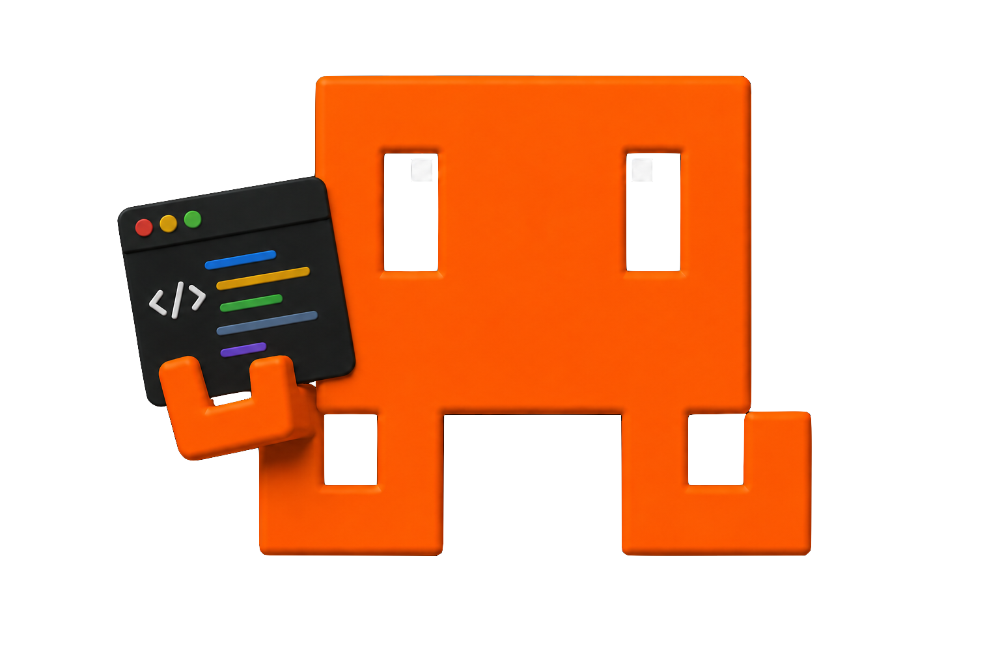
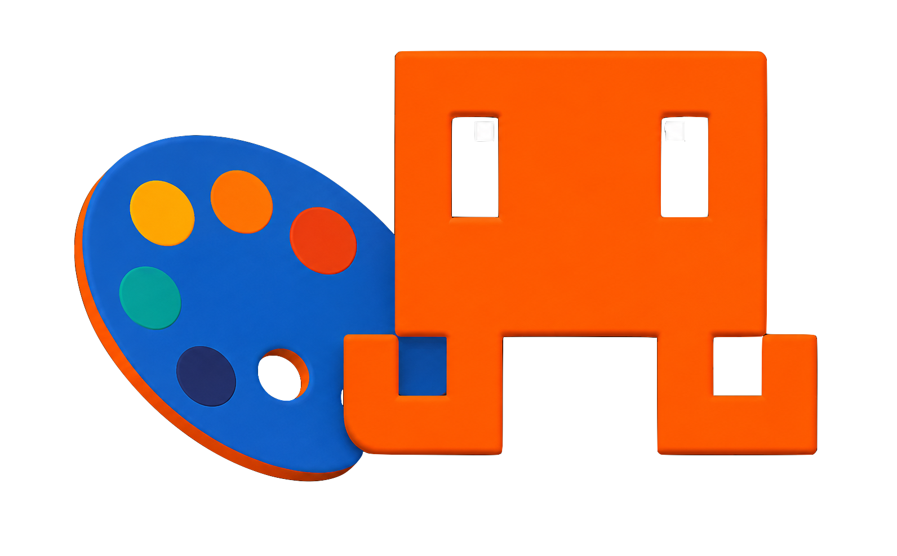
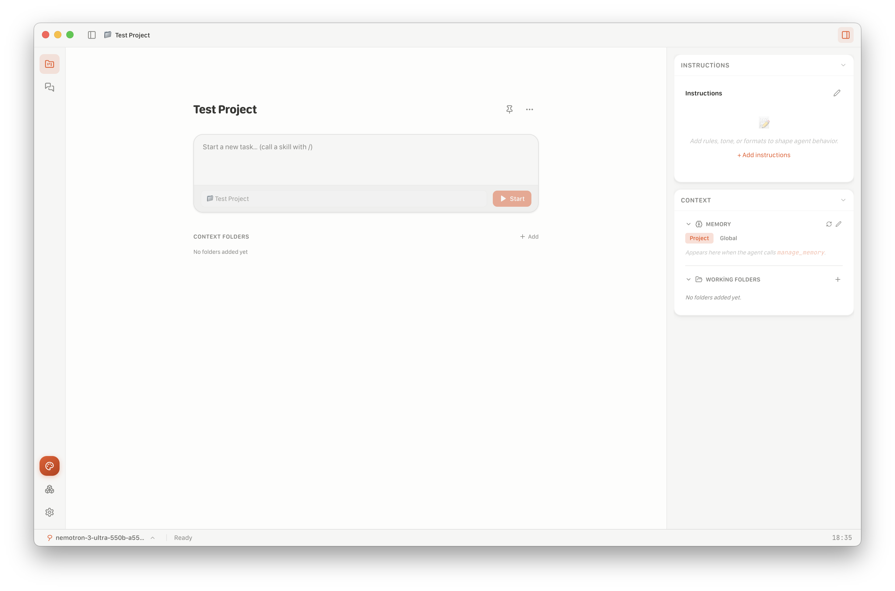
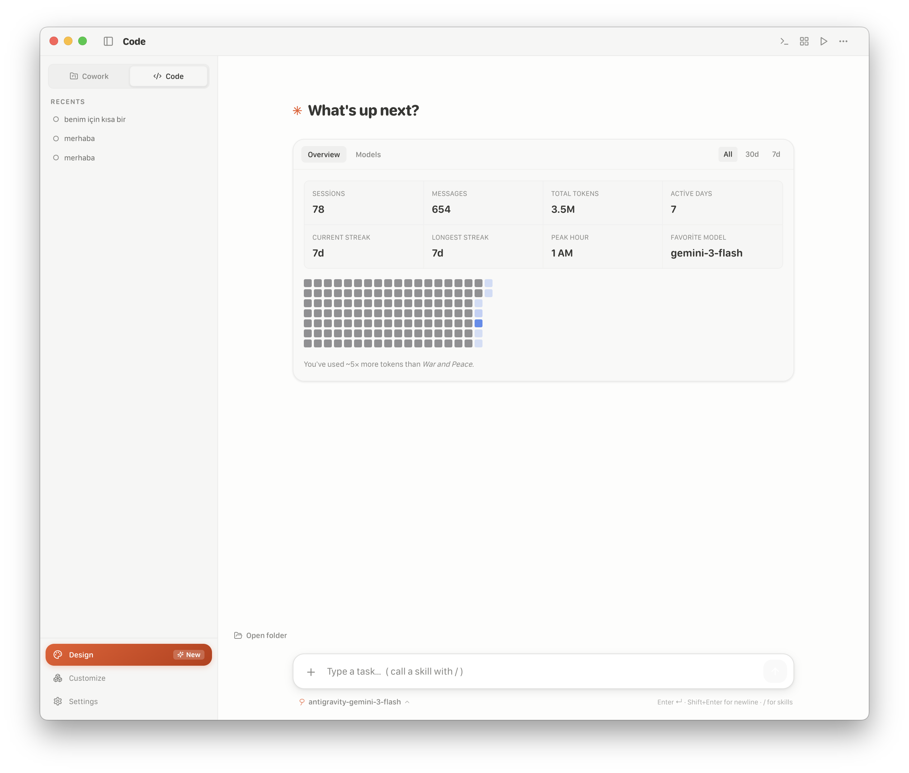

<p align="center">
  &nbsp;&nbsp;
  &nbsp;&nbsp;
  
</p>

<h1 align="center">Co-Wrangler Desktop</h1>

<p align="center">
  <strong>Two surfaces — Code and Design — over one agent engine.</strong>
</p>

<p align="center">
  
  
  
</p>

---

The desktop app runs the same engine as the CLI and shares everything under
`~/.cowrangler` with it — credentials, `config.yaml`, `sessions.db`, skills,
plugins and the permission policy. What differs is the surface.

**Code** is a project workspace: sessions grouped under a project, a real
terminal, working-tree diffs, live preview, plans and task lists.

**Design** opens in its own window and works on a canvas instead of a file tree:
artboards, device mockups, templates, an element inspector and an accessibility
pass.

<p align="center">
  
</p>

---

## Install

Pre-built binaries are on the
[Releases page](https://github.com/furkangonel/cowrangler/releases):

| Platform | File | Notes |
| --- | --- | --- |
| macOS (Intel / Apple Silicon) | `Cowrangler-<version>.dmg` | Mount, drag to Applications |
| Windows | `Cowrangler-Setup-<version>.exe` | Run the installer |
| Linux | `Cowrangler-<version>.AppImage` | `chmod +x`, then run |

> **macOS Gatekeeper.** If macOS says the app is from an unidentified developer,
> right-click it in Finder and choose **Open**, or run
> `xattr -dr com.apple.quarantine "/Applications/Cowrangler.app"`.

### From source

Node ≥ 18, npm, and — on macOS — the Xcode command line tools for the native
modules.

```bash
git clone https://github.com/furkangonel/cowrangler.git
cd cowrangler
./setup-desktop.sh      # install, rebuild natives for Electron's ABI, build
npm run desktop:dev     # hot-reloading dev build
```

Manually, if you prefer:

```bash
npm install --legacy-peer-deps
npm run desktop:rebuild   # better-sqlite3 and node-pty against Electron's ABI
npm run desktop:dev
```

`npm run desktop:pack` produces an installer for the current platform in
`./release/`.

---

## Code

<p align="center">
  
</p>

A project points at one or more local folders and keeps its own session history
and instruction context. Source folders are never uploaded.

- **Right-panel surfaces** — **Terminal** (a real PTY), **Diff** (working-tree
  changes) and **Preview** (live render) toggle from the header. A **⋯** menu
  adds two read-only views, **Plan** and **Tasks**, each shown only once the
  agent has produced one.
- **Git is display-only.** The branch, diff and change counts are shown for
  awareness. The agent stages, commits, pushes or opens a PR **only when you ask
  for it** — never as a side effect of finishing a coding task.
- **Run to verify.** With a terminal available, the agent prefers running your
  tests to prove a change works over asserting that it does.
- **Unified model pool.** The composer's picker draws from your saved models
  plus any contributed by installed plugins — the same pool everywhere in the
  app.
- **Skills and plugins** are managed from the shared Extensions surface, and
  apply to the CLI too.

## Design

<p align="center">
  
</p>

Design opens in a separate window with its own studio palette and a canvas
instead of a file tree.

- **Artboards** render React, HTML, SVG, Mermaid and Three.js, live.
- **Templates** for mobile flows, decks, paginated A4 documents, wireframes,
  motion studies, product screens, résumés, 3D studies and research briefs.
- **Device mockups** wrap an artboard in a phone, tablet or browser frame.
- **Click-to-edit inspector** — select an element on the canvas and edit its
  properties directly.
- **Accessibility pass** flags contrast and touch-target problems before export.
- **Export** to PNG, PDF or the underlying source.

Design has no shell access and writes only inside its own project directory,
which is why it does not prompt for permission the way Code does.

---

## Permissions

The Permissions tab in Settings is the front end for the policy documented in
[docs/permissions.md](../../../../docs/permissions.md). It shows:

- the **mode** a session starts in, and which modes a managed policy has
  disabled;
- the **rules**, in evaluation order (`deny`, `ask`, `allow`), each tagged with
  the settings scope it came from, and read-only when that scope is managed;
- **additional directories** that count as part of the workspace;
- **sandbox** settings — confinement, auto-allow, allowed domains, and commands
  that run outside it.

Edits are written to `.cowrangler/settings.local.json`, which stays on this
machine. A rule from a managed policy is shown but cannot be removed here.

When the agent asks for permission, the prompt names the matched rule or the
layer that decided, and offers **Always allow** when there is a rule worth
saving. Writes to files that could widen the agent's own permissions never offer
it.

---

## Where things live

Shared with the CLI:

| | Path |
| --- | --- |
| Credentials | OS keychain, with a fallback under `~/.cowrangler` |
| Global config | `~/.cowrangler/config.yaml` |
| Permission policy | `~/.cowrangler/settings.json`, `<project>/.cowrangler/settings.json`, `settings.local.json` |
| Sessions | `~/.cowrangler/sessions.db` |
| Per-project machine data | `~/.cowrangler/projects/<project>-<hash>/` |
| Skills | `~/.cowrangler/skills/`, `<project>/.cowrangler/skills/` |

---

## Troubleshooting

**`NODE_MODULE_VERSION` / native binary error on launch.** `better-sqlite3` was
built against your system Node rather than Electron's ABI:

```bash
npm run desktop:rebuild
```

**Design window renders blank.** The canvas compiles artboards with
`esbuild-wasm` and falls back to a CDN when the local build is unavailable.
Check the Design window's console; an offline machine with no precompiled
runtime will say so there.
