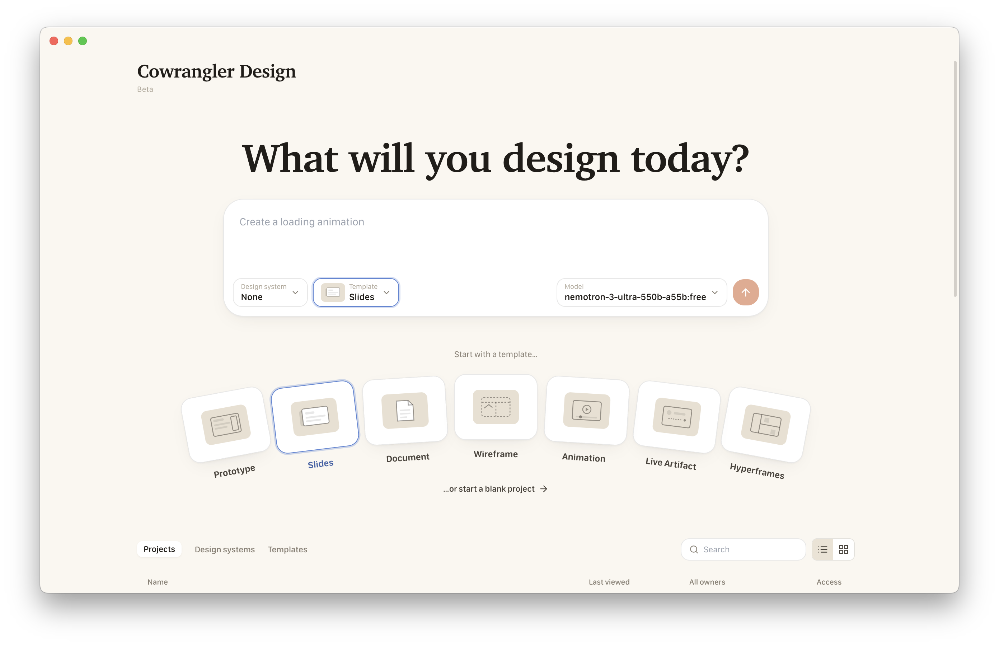
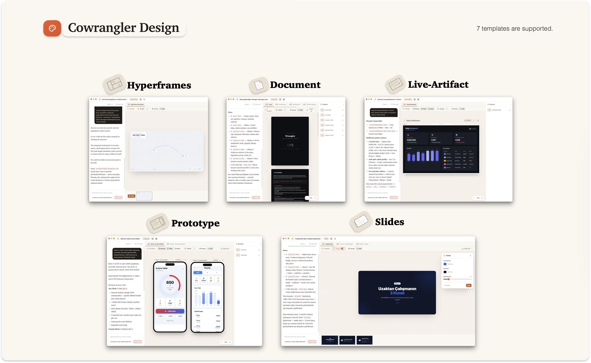
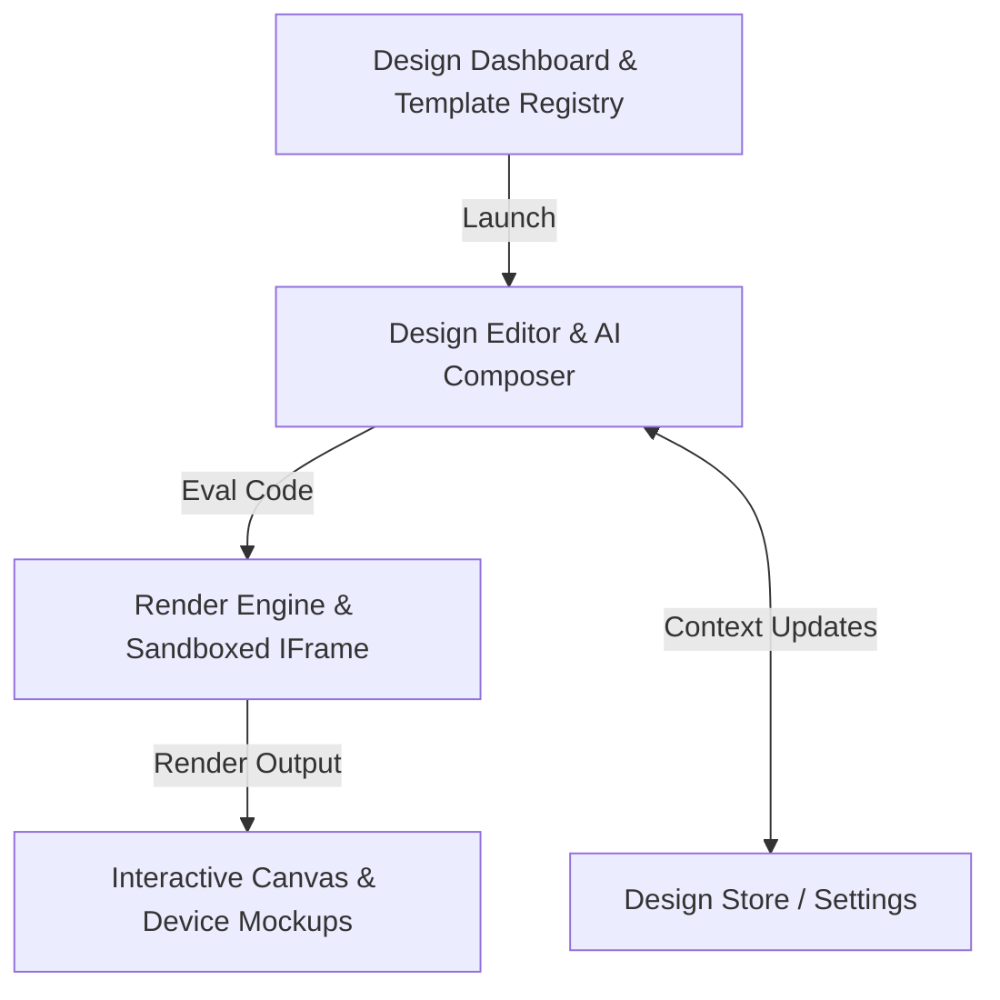

  

<h1 align="center">Cowrangler Design</h1>

  <strong>An interactive visual canvas and sandbox for rapid UI prototyping</strong>

  
  
  

---

**Cowrangler Design** is a visual design playground integrated directly into Cowrangler Desktop. It provides developers and AI agents with an interactive, side-by-side workspace to sketch, develop, and preview React/HTML/CSS interfaces in real time. It enables rapid UI prototyping, responsive testing, and visual adjustments without leaving your project environment.

  

---

## Key Capabilities

* 🎨 **Interactive Live Canvas** — View styling updates and UI changes instantly. The preview automatically runs code in a safe frame, allowing you to click, scroll, and interact with the interface as you build.
* 📱 **Device Frame Mockups** — Validate your designs across different form factors. Toggle between mobile, tablet, and desktop views with responsive grid layouts.
* 💬 **Visual AI Design Assistant** — Prompt your designs to life. Tell the inline agent what component to change, what animation to add, or how to re-arrange layouts, and watch the editor update the design code automatically.
* 🛠 **Curated Design Templates** — Bootstrap projects quickly with pre-built layouts:
  * *Blank Canvas* — Standard starting slate.
  * *Landing Page* — Hero banner, features grid, pricing table, and footers.
  * *Dashboard Layout* — Collapsible side navs, summary cards, charts, and data tables.
  * *Auth Screens* — Login, signup, and password recovery forms.
  * *Widgets / UI Elements* — Feed sections, card list sliders, calendar layouts, navigation bars, and multistep wizards.

  

* 📦 **Custom Design Systems** — Supply the agent with your project's styling guidelines. Connect your stylesheets and token specifications to ensure generated components match your company's aesthetic rules.
* 💾 **Direct Export** — Copy generated code snippets or export structural elements directly to your project workspace files.

---

## Architecture: How it Works

The design engine is divided into three layers:

1. **Sandboxed Evaluation (`renderScreen.ts`):** Evaluates React, Javascript, and styles in a secure sandbox.
2. **Iframe Preview Isolation (`DesignCanvas.tsx`):** Isolates design preview contexts from the desktop app's main process, protecting memory boundaries and running scripts cleanly.
3. **Reactive UI State (`design.store.ts`):** Synchronizes code changes, templates, active canvas logs, and styling overrides across panel views.

---

## Workspace Directory Structure

All design dashboard views and components live under `src/desktop/components/design/`:

* `DesignApp.tsx` — Handles editor panel initialization and active view routing.
* `DesignHome.tsx` — Dashboard presenting your visual projects directory, system presets, and template cards.
* `DesignEditor.tsx` — Side-by-side visual workstation (inline AI chat panel on the left, file inspector, and the visual preview on the right).
* `DesignCanvas.tsx` — Houses the isolated sandbox iframe.
* `DeviceMockup.tsx` — Renders device-specific viewports (Mobile/Tablet/Desktop mock frames).
* `DesignTemplates.tsx` — Houses static layouts code for templates.
* `renderScreen.ts` — Compiles and evaluates visual script buffers.
