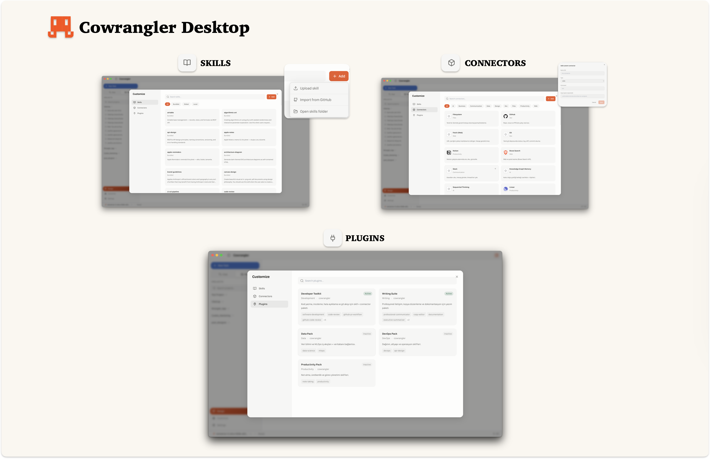

<p align="center">
  
</p>

<h1 align="center">Cowrangler Desktop</h1>

<p align="center">
  <strong>A visual, project-based workspace for your AI developer agent</strong>
</p>

<p align="center">
  
  
  
  
</p>

---

**Cowrangler Desktop** is the official graphical frontend for the Cowrangler agent, offering a rich, visual workbench modeled after Claude's visual workspace. It runs the exact same agent engine as the CLI, utilizing the same SQLite database (`sessions.db`), credentials (`credentials.env`), configurations (`config.yaml`), and skills files under `~/.cowrangler/`.

<p align="center">
  
</p>

---

## Download

Pre-built binaries for macOS, Windows, and Linux are published on the GitHub Releases page:

| OS / Platform | Distribution Package | Description |
|---|---|---|
| 🍎 **macOS** (Intel / Apple Silicon) | `Cowrangler-<version>.dmg` | Mount the DMG file, drag the application to the Applications directory |
| 🪟 **Windows** | `Cowrangler-Setup-<version>.exe` | Run the setup executable to install |
| 🐧 **Linux** | `Cowrangler-<version>.AppImage` | Make the AppImage executable: `chmod +x` and run |

> **Note (macOS Gatekeeper):** If macOS reports that the application cannot be opened because it is from an unidentified developer, right-click the app in Finder and select **Open** (or run `xattr -dr com.apple.quarantine "/Applications/Cowrangler.app"` in your terminal).

---

## Build from Source

### Prerequisites

- **Node.js** ≥ 18
- **npm**
- **Xcode Command Line Tools** (on macOS) for building native modules (`better-sqlite3`)

### Getting Started

Clone the repository and run the setup script:

```bash
git clone https://github.com/furkangonel/cowrangler.git
cd cowrangler

# Run automated desktop configuration & dependency setup
./setup-desktop.sh

# Start the application in development mode (hot-reloading enabled)
npm run desktop:dev
```

If you prefer installing dependencies and rebuilding modules manually:

```bash
npm install --legacy-peer-deps
npm run desktop:rebuild     # Rebuild better-sqlite3 specifically for Electron's ABI
npm run desktop:dev
```

### Packaging Production Builds

Build a production installer for your operating system:

```bash
npm run desktop:pack
```

The output installation binaries will be generated inside the `./release/` directory.

---

## Desktop Features

Cowrangler Desktop brings visual structure to agent workflows:

<p align="center">
  
</p>

* 🗂 **Project Spaces** — Group your chats and settings under dedicated projects. Each project points to a local workspace path, hosts its own sessions history, and runs with project-specific instruction context.
* 💬 **Claude-Style Chat UI** — Converse in a sleek layout featuring streaming Markdown text, collapsible nested tool executions, and instant code diff showcases.
* 📋 **Side-by-Side Progress Panel** — Monitor active operations with the real-time activity sidebar showing the current task check-list, execution checkpoints, and live tool logging.
* ⚙️ **Models & API Settings** — Easily configure provider API keys, pick default models, customize context size ceilings, or input custom model string IDs.
* 🔌 **MCP Connector Manager** — Add, review, and delete Model Context Protocol (MCP) servers (Stdio, HTTP, or SSE configurations) visually, with full parameter collection fields and testing triggers.
* 🎨 **Theme Options** — Toggle between a clean, warm "paper" light layout and a sleek dark theme. Adjust editor font sizes to match your screen layout.
* 🔄 **Status Bar Model Selector** — Hotswap the active model instantly for the ongoing session directly from the footer selector dropdown.

---

## Local Configuration Paths

All data is shared between CLI and Desktop:

- **API Keys / Credentials:** `~/.cowrangler/credentials.env`
- **Global Preferences:** `~/.cowrangler/config.yaml`
- **Sessions & Messages Database:** `~/.cowrangler/sessions.db` (SQLite format)
- **Universal SOP Skills:** `~/.cowrangler/skills/`

---

## Troubleshooting

### Native Module ABI Error (`NODE_MODULE_VERSION`)

If the app fails to launch with an error about native binaries or `better_sqlite3.node`, the SQLite engine was compiled for your system's Node version instead of Electron's internal V8 ABI. Fix this by running:

```bash
npm run desktop:rebuild
```
